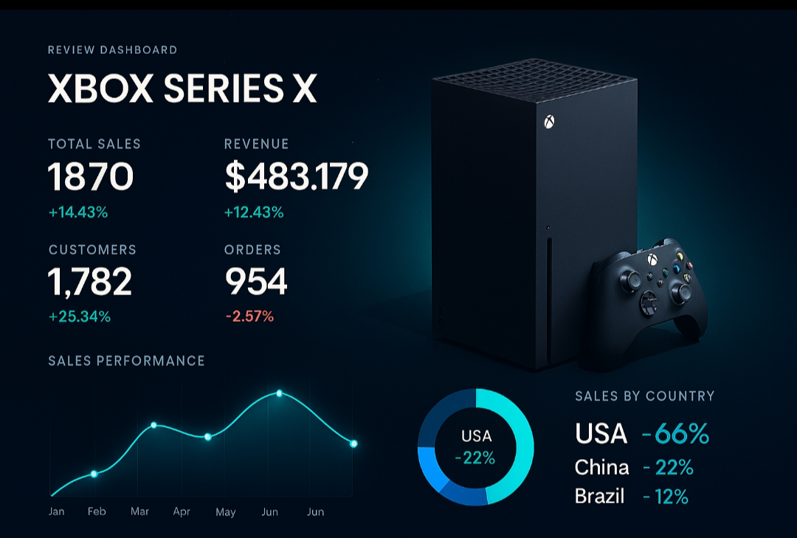

# Criando um Dashboard de Vendas do Xbox com Excel 


**Bootcamp Santander 2025 - Ciência de Dados com Python**

---

# Dashboard de Vendas do Xbox Game Pass em Excel 🎮📊




---

## 📝 Visão Geral

Em empresas de games, acompanhar assinaturas, planos e faturamento de forma rápida e confiável é essencial para decisões estratégicas. 

Este projeto apresenta um dashboard interativo construído em Excel, que transforma dados brutos em informações visuais claras, permitindo uma análise eficaz do desempenho de vendas e suporte à tomada de decisões baseadas em dados reais.

O projeto demonstra boas práticas de **Data Visualization**, organização de dados e documentação profissional, seguindo a metodologia **ABCDE** aplicada a dashboards corporativos.

---

## 🎯 Objetivo do Projeto

* Criar um dashboard que responda perguntas de negócio críticas de forma instantânea.
* Transformar dados complexos e variados em informações visuais acionáveis.
* Demonstrar o domínio de técnicas avançadas de Excel, desde a extração e tratamento até a camada de apresentação.
* Garantir a reprodutibilidade do projeto através de documentação técnica estruturada.

---

## 🚀 Problema que o projeto resolve

Empresas enfrentam desafios quando os dados de vendas estão dispersos ou em formatos não amigáveis. Este dashboard centraliza métricas essenciais para resolver a falta de visibilidade sobre:

* **Faturamento:** Visão total e anualizada.
* **Comportamento:** Performance por tipo de plano e taxa de auto-renovação.
* **Ecossistema:** Volume de vendas de serviços agregados (EA Play e Minecraft Season Pass).
* **Marketing:** Impacto real do uso de cupons e promoções no faturamento final.

---

## 📐 Metodologia ABCDE Aplicada

Esta metodologia garante que o projeto tenha fundamentos sólidos antes mesmo da criação do primeiro gráfico.

* **A — Avaliar:** Definição das perguntas de negócio (Faturamento anual, impacto de renovação automática e vendas de Add-ons).
* **B — Base:** Extração e limpeza do arquivo `data/base01.xlsx`, com tratamento de valores ausentes e normalização de campos.
* **C — Calcular:** Criação de colunas auxiliares e medidas para segmentação por plano, mês e cupons.
* **D — Design:** Aplicação de um *Design System* próprio com a paleta oficial Xbox (#9BC848, #22C55E) e foco em *Data Ink Ratio* (gráficos limpos e sem distrações).
* **E — Entregar:** Disponibilização de arquivos finais, capturas de tela e documentação de apoio.

---

## 🛠️ Decisões Técnicas

* **Por que Excel?** Embora ferramentas como Power BI sejam poderosas, o Excel continua sendo a "língua franca" das empresas. Utilizá-lo para criar dashboards de alto nível demonstra versatilidade e domínio técnico em uma ferramenta onipresente.
* **Gráficos e Segmentações:** O uso de *Slicers* (Segmentação de Dados) foi priorizado para oferecer uma experiência de "aplicativo" ao usuário final.
* **Fórmulas Utilizadas:** Foco em funções de soma condicional (`SUMIFS`) e lógica (`IF`, `TEXT`) para garantir que o dashboard seja escalável caso novos dados sejam inseridos.

---

## 📁 Estrutura do Repositório


---


💻 **Como Executar o Projeto**

​Pré-requisitos: Microsoft Excel 2016 ou superior (Excel 365 recomendado).

**​Passos:**

```
​Clone este repositório: git clone https://github.com/Santosdevbjj/vendasXboxExcelDash.git
```

• **​Abra o arquivo**

```
dashboards/dashboardxboxfinalizado01.xlsx
```


​• Interaja com os filtros laterais para ver os dados se transformarem.

---

​🧠 **Aprendizados e Desafios**

• ​Tratamento de Dados: O maior desafio foi normalizar a coluna de preços quando havia valores nulos ou "strings" mistas, resolvido com colunas auxiliares de limpeza.

• ​UX Design: Aprender a equilibrar a identidade visual forte do Xbox (verde vibrante) com a necessidade de um dashboard que não canse a vista do analista.

​• Documentação: A prática de documentar cada etapa em Markdown reforçou a importância de criar projetos "prontos para equipe" e não apenas para uso pessoal.

---

​🔮 **Próximos Passos**

• ​[ ] Automatizar a atualização da base via Power Query.

​• [ ] Implementar uma aba de Análise Preditiva simples para projetar o faturamento do próximo trimestre.

• ​[ ] Criar uma versão complementar deste dashboard em Power BI para comparação de performance.


---

**Autor:**
Sergio Santos 


---


**Contato:**


[](https://santosdevbjj.github.io/portfolio/)
[](https://linkedin.com/in/santossergioluiz) 


---

