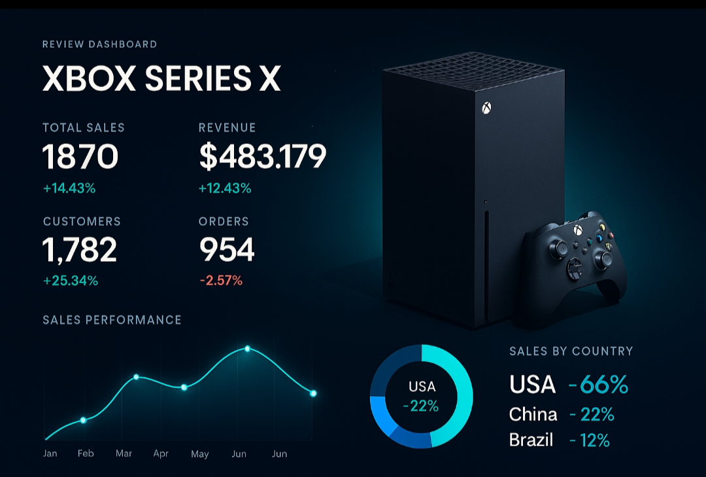
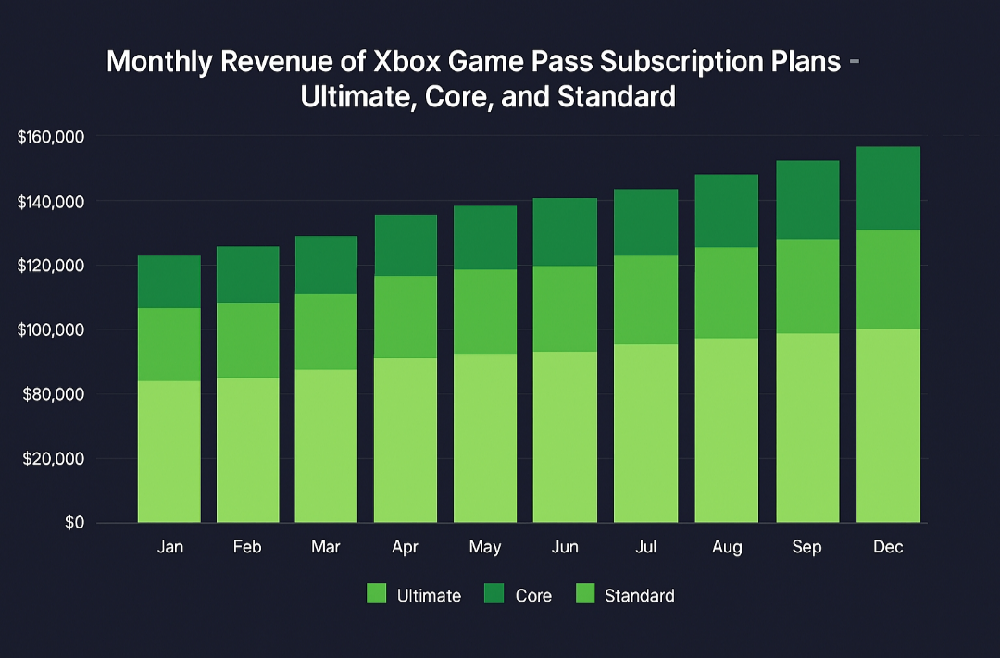
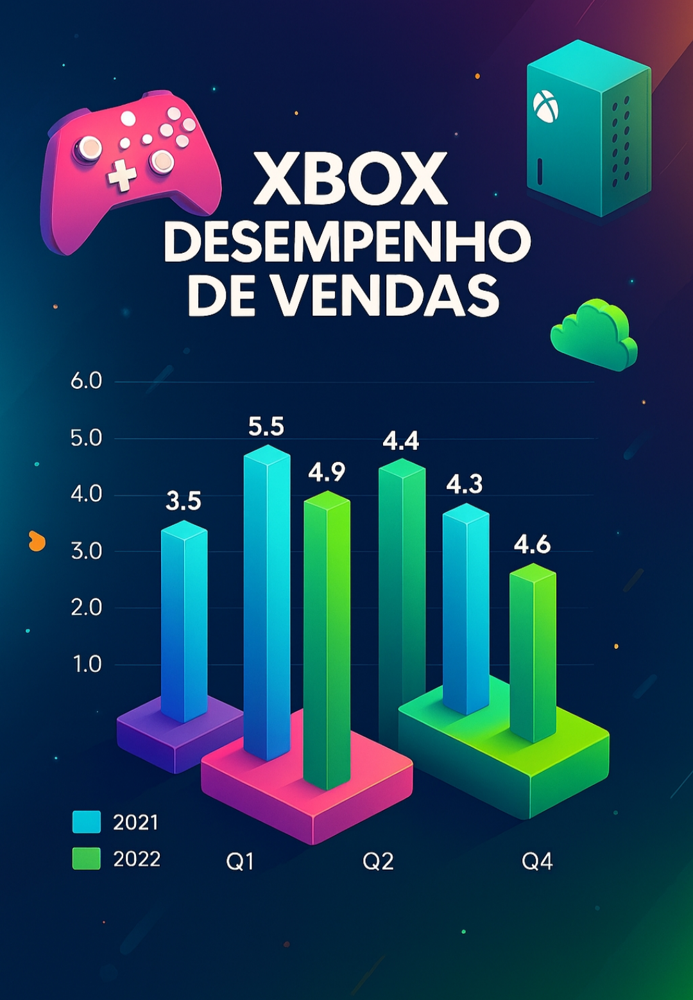
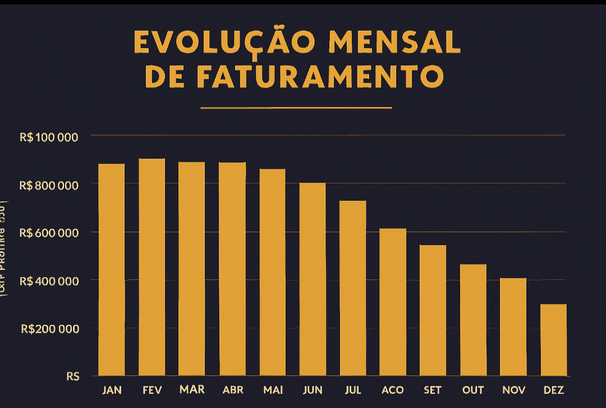
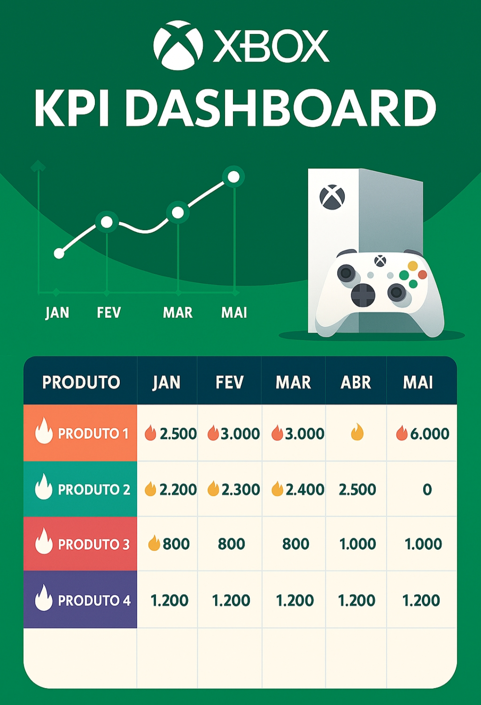
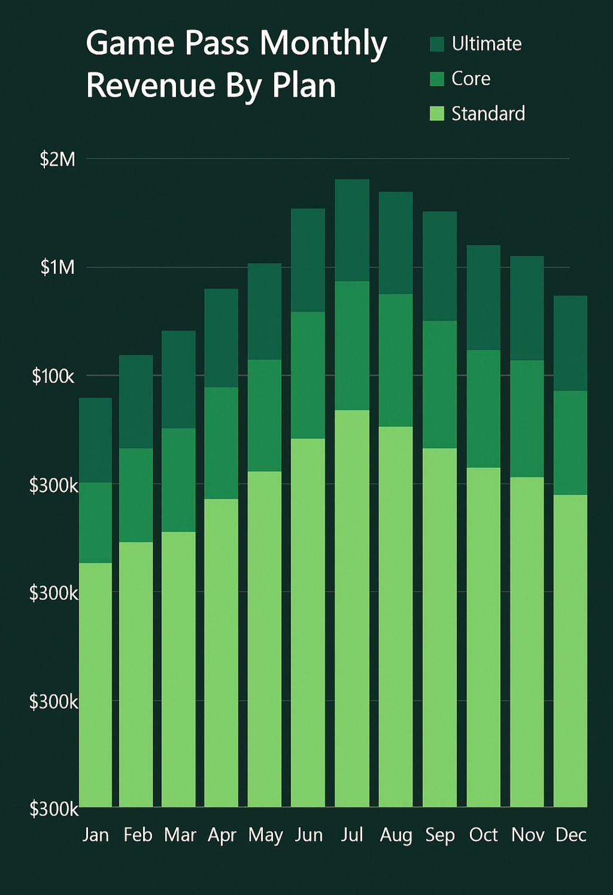

# Dashboard de Vendas do Xbox Game Pass em Excel


**Bootcamp Santander 2025 — Ciência de Dados com Python**

---

## 📑 Sumário

- [1. Problema de Negócio](#1-problema-de-negócio)
- [2. Contexto](#2-contexto)
- [3. Premissas da Análise](#3-premissas-da-análise)
- [4. Planejamento da Solução — Metodologia ABCDE](#4-planejamento-da-solução--metodologia-abcde)
- [5. Preparação e Limpeza dos Dados](#5-preparação-e-limpeza-dos-dados)
- [6. Cálculo das Métricas e KPIs](#6-cálculo-das-métricas-e-kpis)
- [7. Design e Visualização](#7-design-e-visualização)
- [8. Insights da Análise](#8-insights-da-análise)
- [9. Resultados para o Negócio](#9-resultados-para-o-negócio)
- [10. Dashboard em Uso](#10-dashboard-em-uso)
- [11. Decisões Técnicas e Trade-offs](#11-decisões-técnicas-e-trade-offs)
- [12. Estrutura do Repositório](#12-estrutura-do-repositório)
- [13. Como Executar](#13-como-executar)
- [14. Próximos Passos](#14-próximos-passos)
- [Contato](#contato)

---

## 1. Problema de Negócio

**Qual problema este projeto resolve?**

Empresas de games e serviços de assinatura acumulam dados valiosos sobre seus clientes — planos contratados, renovações, add-ons, descontos — mas frequentemente esses dados ficam presos em planilhas brutas, sem transformação em respostas rápidas para o negócio.

O desafio concreto que este projeto resolve é:

> *"Como a equipe de vendas e marketing do Xbox Game Pass pode responder, em segundos e sem depender de analistas, perguntas críticas como: qual o faturamento anual total? Quais planos têm maior taxa de renovação? Quanto os add-ons EA Play e Minecraft contribuem para a receita? O uso de cupons está impactando negativamente o faturamento?"*

Hoje, sem um dashboard estruturado, responder cada uma dessas perguntas exige abrir a planilha bruta, aplicar filtros manualmente, montar cálculos e interpretar os números — processo lento, sujeito a erro e não escalável para tomada de decisão em tempo real.

A resposta está em um **dashboard interativo em Excel** que centraliza todos os KPIs críticos em uma única tela, com filtros dinâmicos que permitem segmentar por plano, tipo de assinatura, período e presença de cupom — entregando a resposta certa para cada pergunta em menos de 10 segundos.

---

## 2. Contexto

O **Xbox Game Pass** opera com três níveis de plano (Core, Standard e Ultimate), três tipos de cobrança (Monthly, Quarterly, Annual) e dois serviços agregados opcionais (EA Play Season Pass e Minecraft Season Pass). Cada assinante pode ou não utilizar cupom de desconto, e pode ou não ter renovação automática ativada.

Essa combinação de variáveis cria um cenário de análise multidimensional que é impossível de gerenciar com leitura direta da planilha bruta.

O cenário antes do dashboard:

- Dados brutos em `data/base01.xlsx` sem segmentação ou agregação.
- Nenhuma visibilidade imediata sobre faturamento por tipo de assinatura, por plano ou por período.
- Impossibilidade de responder rapidamente quanto o EA Play e o Minecraft contribuem para a receita total.
- Sem análise do impacto de cupons no faturamento final.
- Sem visibilidade sobre a taxa de renovação automática por plano — métrica crítica para retenção.

Este projeto transforma essa base bruta em um **painel de controle executivo** que responde as quatro perguntas de negócio mais críticas da operação em tempo real.

---

## 3. Premissas da Análise

Para a construção do dashboard, foram adotadas as seguintes premissas:

- O campo `Total Value` é o KPI primário de faturamento — ele já contempla valor da assinatura + add-ons − cupom, e foi validado por amostragem manual.
- Valores `"-"` nas colunas de preço de Season Pass são tratados como `0` — assinante não contratou o add-on.
- O campo `Subscriber ID` é único e não se repete — chave primária da base sem duplicidades.
- As colunas auxiliares `Month` e `Has Coupon` não existem na base original e foram criadas via fórmula para permitir segmentações temporais e por promoção.
- As análises focam nos planos **Annual** como principal KPI de faturamento, pois representam o maior valor por assinante e o maior indicador de retenção de longo prazo.
- O período analisado é considerado uma amostra válida e representativa do comportamento de assinaturas da operação.

---

## 4. Planejamento da Solução — Metodologia ABCDE

O projeto seguiu a metodologia **ABCDE**, um framework estruturado para garantir que cada etapa tenha um propósito claro antes de criar o primeiro gráfico.

**A — Avaliar: Definir as perguntas de negócio**

Quatro perguntas foram definidas como o centro do dashboard:

| # | Pergunta de Negócio | KPI Correspondente |
|---|---|---|
| P1 | Qual o faturamento total de planos anuais? | Soma de `Total Value` onde `Subscription Type = Annual` |
| P2 | Qual o faturamento anual separado por auto-renovação? | P1 segmentado por `Auto Renewal = Yes / No` |
| P3 | Qual o total de vendas do EA Play Season Pass? | Soma de `EA Play Season Pass Price` onde flag = Yes |
| P4 | Qual o total de vendas do Minecraft Season Pass? | Soma de `Minecraft Season Pass Price` onde flag = Yes |

**B — Base: Conhecer e organizar os dados**

Arquivo `data/base01.xlsx` com os campos principais:

| Campo | Tipo | Papel na análise |
|---|---|---|
| Subscriber ID | Numérico | Chave primária — unicidade garantida |
| Plan | Categórico (Core / Standard / Ultimate) | Segmentação principal |
| Subscription Type | Categórico (Monthly / Quarterly / Annual) | Filtro de faturamento anual |
| Auto Renewal | Flag (Yes / No) | Análise de retenção |
| Total Value | Moeda | KPI principal de faturamento |
| EA Play Season Pass Price | Moeda | KPI de receita de add-on |
| Minecraft Season Pass Price | Moeda | KPI de receita de add-on |
| Coupon Value | Moeda | Análise de impacto de promoções |

**C — Calcular: Transformar dados em métricas**

Aplicação de `SUMIFS` e Tabelas Dinâmicas para cada KPI. Colunas auxiliares criadas via fórmula para habilitar segmentações.

**D — Design: Transformar métricas em visualizações**

Design System próprio com paleta oficial Xbox, Slicers interativos e cards de Big Numbers. Foco em *Data Ink Ratio* — máxima informação com mínimo de ruído visual.

**E — Entregar: Disponibilizar e documentar**

Dashboard final, documentação técnica completa e capturas de tela para validação.

---

## 5. Preparação e Limpeza dos Dados

### Tratamento de valores ausentes

A coluna de preços de Season Pass utiliza `"-"` para indicar que o add-on não foi contratado. Sem tratamento, esse valor quebra cálculos de soma. A fórmula de normalização foi aplicada em toda a coluna:

```excel
=IF(A2="-";0;A2)
```

Aplicada em: `EA Play Season Pass Price` e `Minecraft Season Pass Price`.

### Criação de colunas auxiliares

Duas colunas não existem na base original e são criadas via fórmula para habilitar análises temporais e por promoção:

**Coluna `Month`** — extrair mês/ano da data de início para análise de sazonalidade:

```excel
=TEXT([@Start Date];"YYYY-MM")
```

**Coluna `Has Coupon`** — identificar se o assinante utilizou desconto:

```excel
=IF([@Coupon Value]>0;"Yes";"No")
```

### Estruturação como Tabela formal

A base foi convertida em Tabela estruturada do Excel (`Ctrl + T`), nomeada `tblSubscriptions`. Isso garante que as fórmulas `SUMIFS` se referenciem por nome de coluna — não por intervalo fixo — tornando o dashboard escalável quando novos dados forem inseridos.

### Checklist de qualidade aplicado

Antes de construir qualquer gráfico, o `docs/checklist_qa.md` foi executado:

- Tipos de dados validados (datas como Date, valores como Number, flags como Text).
- `Subscriber ID` verificado como único — sem duplicidades.
- Amostragem manual de 10 linhas para validação do `Total Value`.
- Confirmação que `"-"` foram convertidos para `0` em todas as colunas de preço.

---

## 6. Cálculo das Métricas e KPIs

### Fórmulas principais implementadas

**P1 — Faturamento total de planos anuais:**

```excel
=SUMIFS(tblSubscriptions[Total Value];
        tblSubscriptions[Subscription Type];"Annual")
```

**P2 — Faturamento anual por auto-renovação:**

```excel
=SUMIFS(tblSubscriptions[Total Value];
        tblSubscriptions[Subscription Type];"Annual";
        tblSubscriptions[Auto Renewal];"Yes")

=SUMIFS(tblSubscriptions[Total Value];
        tblSubscriptions[Subscription Type];"Annual";
        tblSubscriptions[Auto Renewal];"No")
```

**P3 — Total de vendas EA Play Season Pass:**

```excel
=SUMIFS(tblSubscriptions[EA Play Season Pass Price];
        tblSubscriptions[EA Play Season Pass];"Yes")
```

**P4 — Total de vendas Minecraft Season Pass:**

```excel
=SUMIFS(tblSubscriptions[Minecraft Season Pass Price];
        tblSubscriptions[Minecraft Season Pass];"Yes")
```

### Tabelas Dinâmicas como camada analítica

Para cada pergunta de negócio, uma Tabela Dinâmica foi criada com nomenclatura padronizada:

| Pivot | Pergunta que responde | Filtro aplicado |
|---|---|---|
| `PivotAnnualRevenue` | P1 — Faturamento anual total | Subscription Type = Annual |
| `PivotAutoRenewal` | P2 — Faturamento por renovação | Annual + Auto Renewal Yes/No |
| `PivotEAPlay` | P3 — Receita EA Play | EA Play Season Pass = Yes |
| `PivotMinecraft` | P4 — Receita Minecraft | Minecraft Season Pass = Yes |

---

## 7. Design e Visualização

### Design System — Paleta Visual Xbox

O dashboard foi construído com um Design System próprio inspirado na identidade visual do Xbox, garantindo consistência visual e leitura rápida dos dados.

| Elemento | Cor | Código HEX | Uso |
|---|---|---|---|
| Xbox Green | 🟢 | `#9BC848` | Títulos e destaques principais |
| Secondary Green | 🟢 | `#22C55E` | Gráficos positivos e KPIs |
| Aqua Accent | 🩵 | `#2AE6B1` | Diferenciação de categorias |
| Menu Green | 🟩 | `#5BF6A8` | Slicers e filtros visuais |
| Neutral Gray | ⬜ | `#E8E6E9` | Fundo e áreas de respiro |

### Tipografia

- Fonte padrão: Calibri (Excel default).
- Títulos: negrito, 16–20 pt.
- Big Numbers: 24–28 pt em verde principal `#9BC848`.
- Rótulos de gráficos: 10–12 pt, sempre legíveis sem sobreposição.

### Estrutura do layout

```
┌─────────────────────────────────────────────────────────┐
│      XBOX GAME PASS SUBSCRIPTIONS SALES                  │
├─────────────────────────────────────────────────────────┤
│  [Plan]  [Auto Renewal]  [Subscription Type]  [Month]   │  ← Slicers
├──────────┬──────────┬──────────┬─────────────────────────┤
│Faturamento│Auto-Renov│  EA Play │    Minecraft            │  ← Big Numbers
│  Anual   │ Yes / No │  Total   │     Total               │
├──────────┴──────────┴──────────┴─────────────────────────┤
│ [Gráfico Barras: Planos]  [Gráfico Pizza: Renovação]     │  ← Gráficos
│ [Gráfico Colunas: Mensal] [Gráfico Barras: Add-ons]      │
├─────────────────────────────────────────────────────────┤
│  Info Context: "Faturamento considera apenas Annual"     │  ← Rodapé
└─────────────────────────────────────────────────────────┘
```

### Princípio de *Data Ink Ratio*

Cada elemento visual no dashboard existe para comunicar dado — não para decorar. As decisões de design que sustentam esse princípio:

- Linhas de grade removidas na aba Dashboard.
- Legendas incluídas somente onde não há outra forma de identificar a categoria.
- Rótulos de dados ativados diretamente nos gráficos, eliminando a necessidade de consultar eixos.
- Info Context no rodapé evita ambiguidade sobre o escopo de cada KPI.

---

## 8. Insights da Análise

A exploração dos dados revelou padrões relevantes para decisões de produto e marketing:

- **Auto-renovação é o principal preditor de receita anual previsível:** assinaturas com `Auto Renewal = Yes` representam a parcela mais estável e recorrente do faturamento — e devem ser o foco de estratégias de retenção.

- **O plano Ultimate concentra o maior valor médio por assinante:** a segmentação por plano revela que Core, Standard e Ultimate têm comportamentos de faturamento distintos, com Ultimate gerando receita por assinante significativamente superior.

- **Add-ons são receita incremental subestimada:** EA Play e Minecraft Season Pass representam receita adicional gerada sem aquisição de novo cliente — upsell puro. O dashboard torna visível esse potencial que frequentemente fica oculto na planilha bruta.

- **Cupons impactam o Total Value de forma não linear:** nem todo uso de cupom reduz proporcionalmente o faturamento — a segmentação por `Has Coupon` permite avaliar se as promoções estão convertendo planos de maior valor ou apenas descontando assinaturas que seriam adquiridas de qualquer forma.

- **Sazonalidade mensal identificada via coluna `Month`:** a análise de evolução mensal de faturamento, habilitada pela coluna auxiliar, revela padrões de alta e baixa que podem guiar campanhas de marketing e projeções de receita.

---

## 9. Resultados para o Negócio

### O que o dashboard entrega

| Pergunta | Antes do Dashboard | Depois do Dashboard |
|---|---|---|
| Faturamento anual total | Calcular manualmente com filtros | Big Number visível em < 2 segundos |
| Faturamento por auto-renovação | Processo manual de 10–15 minutos | Gráfico interativo em tempo real |
| Receita de EA Play e Minecraft | Invisível — sem agregação | KPI dedicado com valor total |
| Impacto de cupons | Desconhecido sem análise específica | Slicer `Has Coupon` para comparação imediata |
| Evolução mensal de faturamento | Análise sob demanda | Gráfico de colunas mensais atualizado automaticamente |
| Segmentação por plano | Filtro manual na planilha bruta | Slicer `Plan` conectado a todos os gráficos |

### Impacto operacional

- **Velocidade de decisão:** qualquer pergunta listada acima é respondida em menos de 10 segundos com o dashboard — sem abrir a planilha bruta.
- **Autonomia das áreas:** equipes de vendas, marketing e produto podem filtrar e analisar dados sem depender do analista para cada consulta.
- **Escalabilidade:** a estrutura de Tabela (`tblSubscriptions`) garante que novos dados inseridos nas linhas da base atualizam todos os KPIs e gráficos automaticamente — sem reconfiguração.
- **Confiabilidade:** o `docs/checklist_qa.md` foi executado antes da entrega, garantindo consistência entre fórmulas `SUMIFS` e Tabelas Dinâmicas.

---

## 10. Dashboard em Uso

### Capturas de tela

**Dashboard completo:**



**KPIs estratégicos de faturamento:**



**Desempenho de vendas por plano:**



**Evolução mensal do faturamento:**



**KPIs do dashboard — visão consolidada:**



**Distribuição mensal por plano Xbox Game Pass:**



---

## 11. Decisões Técnicas e Trade-offs

### Por que Excel — e não Power BI ou Python?

O Excel é a **"língua franca" corporativa**: presente em praticamente 100% das empresas, não exige instalação, não exige licença adicional e não exige conhecimento técnico para consumo. Um dashboard em Excel pode ser aberto, filtrado e apresentado por qualquer pessoa da equipe — do analista ao diretor.

Isso não é limitação — é uma decisão estratégica de entrega. Um dashboard que só funciona em Python ou Power BI é um dashboard que depende de um guardião técnico para ser útil. Este projeto foi construído para ser autônomo.

### Slicers como interface de "aplicativo"

Em vez de menus de filtro convencionais, o uso de **Slicers** (Segmentação de Dados) transforma a experiência de uso do Excel em algo próximo de um aplicativo de BI — o usuário clica em um botão visual e todos os gráficos reagem simultaneamente. Isso reduz a curva de aprendizado para zero.

### `SUMIFS` estrutural vs. Tabelas Dinâmicas

As fórmulas `SUMIFS` foram mantidas em uma aba `Calc` separada como camada de validação — permitindo comparação direta com os valores das Tabelas Dinâmicas. Qualquer discrepância entre as duas camadas é detectada imediatamente. Isso garante confiabilidade auditável dos números.

### Trade-offs documentados

- **Tabelas Dinâmicas vs. fórmulas diretas:** Tabelas Dinâmicas são mais flexíveis para segmentação, mas requerem "Atualizar Tudo" quando os dados mudam. A instrução está documentada no checklist de operação.
- **Design forte vs. legibilidade:** a identidade visual do Xbox usa verde vibrante. O equilíbrio entre fidelidade à marca e conforto visual para o analista foi alcançado usando tons mais saturados apenas nos destaques (Big Numbers e títulos) e neutros nos fundos.
- **Colunas auxiliares vs. complexidade:** `Month` e `Has Coupon` aumentam a quantidade de colunas, mas habilitam segmentações que seriam impossíveis sem elas. O dicionário de dados documenta sua origem e fórmula.

---

## 12. Estrutura do Repositório

```text
vendasXboxExcelDash/
│
├── data/
│   ├── base01.xlsx                    # Base bruta de assinantes Xbox Game Pass
│   └── dicionario_dados.md            # Descrição de cada campo, tipo e observações
│
├── dashboards/
│   ├── Dashboard_Vendas.xlsx          # Versão de trabalho e desenvolvimento
│   └── dashboard_xbox_finalizado01.xlsx  # Versão final entregável — abrir este
│
├── docs/
│   ├── capturas/
│   │   ├── dashboard_xbox.png              # Dashboard completo
│   │   ├── dashboard_kpi_xbox.png          # Visão consolidada dos KPIs
│   │   ├── desempenho_vendas_xbox.png      # Desempenho por plano
│   │   ├── evolucao_mensal_faturamento.png # Faturamento mês a mês
│   │   ├── kpi_estrategico_faturamento.png # KPIs estratégicos isolados
│   │   └── mensal_planos_xboxgame_pass.png # Distribuição mensal por plano
│   ├── checklist_qa.md                # Checklist de qualidade — executar antes de publicar
│   ├── design_system.md               # Paleta de cores, tipografia e layout
│   └── metodologia_ABCDE.md           # Detalhamento de cada etapa do framework ABCDE
│
└── scripts/
    └── formulas_e_dicas.md            # Todas as fórmulas Excel utilizadas com exemplos
```

### Estrutura visual do repositório


---

## 13. Como Executar

### Pré-requisitos

- Microsoft Excel 2016 ou superior.
- Excel 365 recomendado (melhor compatibilidade com Slicers e Tabelas Dinâmicas).

### Passo 1 — Clonar o repositório

```bash
git clone https://github.com/Santosdevbjj/vendasXboxExcelDash.git
cd vendasXboxExcelDash
```

### Passo 2 — Abrir o dashboard final

```
dashboards/dashboard_xbox_finalizado01.xlsx
```

### Passo 3 — Interagir com os filtros

- Clique nos **Slicers** laterais para filtrar por plano, tipo de assinatura, período ou presença de cupom.
- Todos os gráficos e Big Numbers reagem simultaneamente ao filtro selecionado.
- Para limpar os filtros, clique no ícone de limpeza no canto superior direito de cada Slicer.

### Passo 4 — Atualizar com novos dados (manutenção)

1. Abrir `data/base01.xlsx` e inserir novos registros nas linhas seguintes.
2. Retornar ao dashboard e executar **Dados → Atualizar Tudo**.
3. Todos os KPIs, gráficos e Tabelas Dinâmicas refletem os novos dados automaticamente.
4. Executar o `docs/checklist_qa.md` para validar consistência após atualização.

### Passo 5 — Explorar a documentação de suporte

| Documento | Caminho | Para quem |
|---|---|---|
| Dicionário de Dados | `data/dicionario_dados.md` | Quem quiser entender os campos da base |
| Fórmulas e Dicas | `scripts/formulas_e_dicas.md` | Quem quiser reproduzir ou adaptar o projeto |
| Metodologia ABCDE | `docs/metodologia_ABCDE.md` | Quem quiser entender o processo de construção |
| Design System | `docs/design_system.md` | Quem quiser adaptar o visual para outro contexto |
| Checklist de QA | `docs/checklist_qa.md` | Quem for publicar ou apresentar o dashboard |

---

## 14. Próximos Passos

Com base nos resultados obtidos, os próximos passos recomendados são:

- **Power Query:** automatizar a atualização da base — novos dados carregados de uma fonte externa sem intervenção manual na planilha.
- **Análise Preditiva:** implementar uma aba de projeção de faturamento trimestral com base na tendência histórica mensal — transformando o dashboard de retrospectivo para preditivo.
- **Versão Power BI:** criar uma versão complementar do dashboard em Power BI para comparação de capacidades e portfólio de ferramentas de BI.
- **Segmentação por região:** incluir o campo de localização geográfica dos assinantes para análise de performance por mercado.
- **Análise de churn:** cruzar dados de `Auto Renewal = No` com a evolução temporal para identificar padrões de cancelamento e antecipar ações de retenção.

---

**Autor:** Sergio Santos

[](https://portfoliosantossergio.vercel.app)

[](https://linkedin.com/in/santossergioluiz)

---


